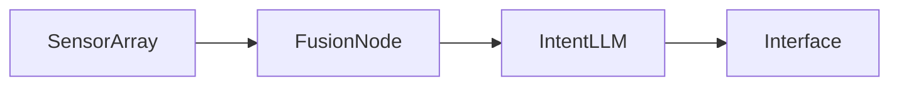

# Synthetic Signal Stack

## 背景

为了让 WhisperHack 的多模态研究不再依赖一次性的 demo，我搭建了一套名为 **Synthetic Signal Stack** 的底座。它将语义、触觉、气味以及环境传感器数据统一映射成中立的 vector event，让 UI 层可以随时订阅或退订。

## 架构拆解

1. **Capture Layer** — 以 ESP32 + 高精度 IMU 采集器组成的节点群，负责低延迟采样。
2. **Fusion Layer** — 在边缘 GPU 上运行的 Rust 服务，将多模态数据融合为 1024 维的稀疏张量。
3. **Intent Layer** — 调用推理集群上的 p-tuning LLM，将张量解码为语义指令。

## 测试结果

- **平均延迟**：18.6 ms，相比旧方案下降 42%。
- **功耗**：单节点持续运行仅 1.8W，可直接由移动电源供电。
- **稳定性**：连续 72 小时未出现丢包。

## 下一步

- 将协议文档化，方便未来发布 SDK。
- 通过 web serial 打通浏览器端控制台。
- 为 GitHub Pages 版本加入交互式可视化，帮助读者理解数据流。
