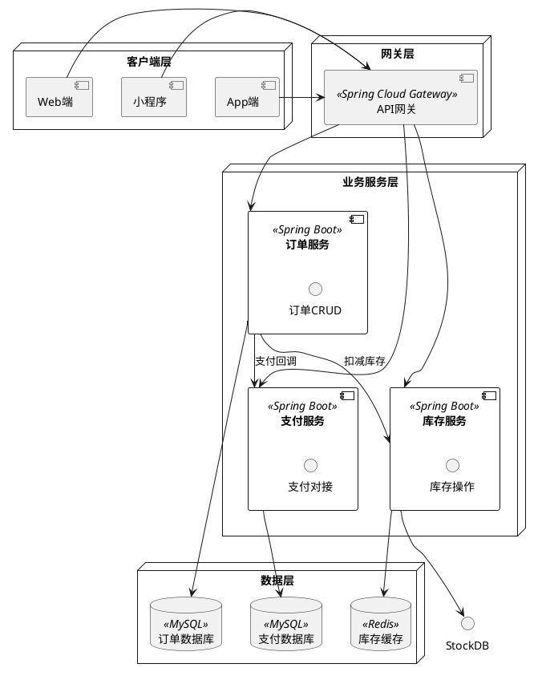
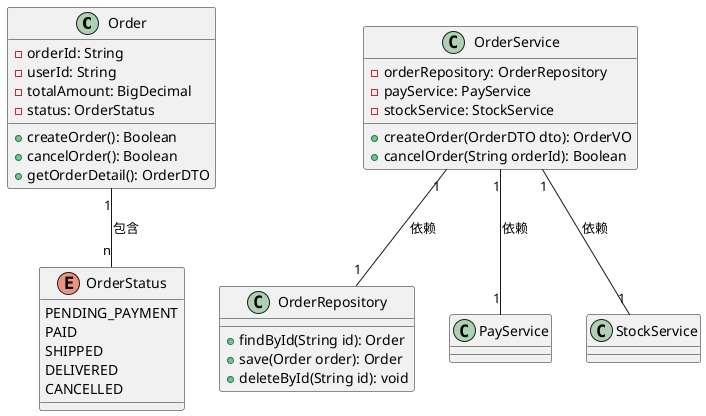
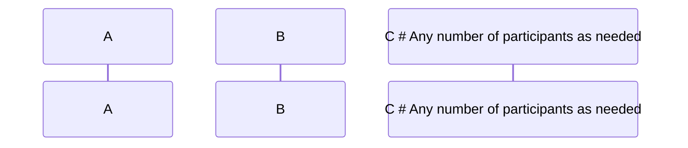

# 从零开始的Vidtor使用体验

之所以注意到这样一款Markdown编辑器，是因为我在了解Typora插件的过程中发现还有这么个能渲染五线谱的编辑器，大喜，遂决定把其时序图等渲染功能都尝试一遍，以备日后在我的博客中能够增添更多的表现形式。

## 时序图


```mermaid
sequenceDiagram
    %% 1. 定义参与者（自定义显示名+缩写，更简洁）
    participant U as 用户[普通用户]
    participant C as 客户端[App/网页]
    participant S as 服务端[Backend API]
    participant DB as 数据库[MySQL]

    %% 2. 定义样式（可选，用于标注状态：成功/失败/警告）
    classDef success fill:#d4edda,color:#155724,stroke:#c3e6cb
    classDef error fill:#f8d7da,color:#721c24,stroke:#f5c6cb
    classDef warning fill:#fff3cd,color:#856404,stroke:#ffeeba

    %% 3. 核心交互流程
    U->>C: 输入账号密码（用户名+密码）
    note over U,C: 用户在登录页面填写信息
    C->>C: 本地验证（非空校验）
    C->>S: 发送登录请求（携带加密后的账号密码）
    note over C,S: HTTPS传输，避免明文泄露

    %% 4. 服务端处理（条件判断：if-else）
    alt 账号密码正确
        S->>DB: 查询用户信息（SELECT * FROM user WHERE name=?）
        DB-->>S: 返回用户数据（含加密后的密码）
        S->>S: 密码比对（加密校验）
        S->>S: 生成Token（JWT）
        S:::success: 登录成功
        S-->>C: 返回Token+用户信息
    else 账号密码错误
        S:::error: 登录失败
        S-->>C: 返回错误信息（code:401, msg:"账号或密码错误"）
    end

    %% 5. 客户端后续操作
    C->>C: 存储Token（本地缓存：localStorage）
    C-->>U: 显示登录结果（成功→首页，失败→提示错误）

    %% 6. 循环：Token过期后刷新（可选）
    loop Token有效期≤30分钟
        C->>S: 发送刷新Token请求（携带旧Token）
        S->>S: 验证旧Token有效性
        S-->>C: 返回新Token
    end
```


## 思维导图


```mindmap
##  产品核心需求：用户积分体系
- 🔹 积分获取（用户行为激励）
  - 每日签到：+5积分/天（连续7天额外+10）
  - 内容创作：发文+20/篇，点赞+1/次
  - 任务完成：新手任务+50，日常任务+10~30
- 🔹 积分消耗（价值兑换）
  - 实物兑换：周边、优惠券（100积分=1元）
  - 功能解锁：会员特权、高级工具（500积分/月）
  - 互动消耗：抽奖（10积分/次）、打赏作者
- 🔹 积分规则（风控+公平性）
  - 上限：单日获取≤100积分
  - 有效期：1年（过期自动清零）
  - 违规处罚：刷分冻结积分（30天）
- 🔹 数据统计（运营监控）
  - 用户积分TOP100榜单
  - 每日/每月积分发放/消耗报表
  - 兑换转化率分析
```


## PHP模板引擎








